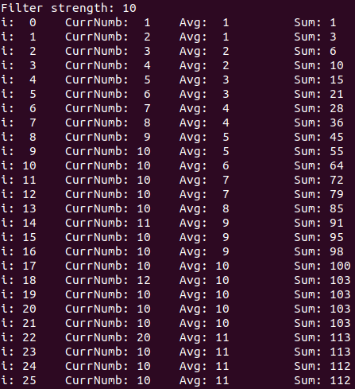
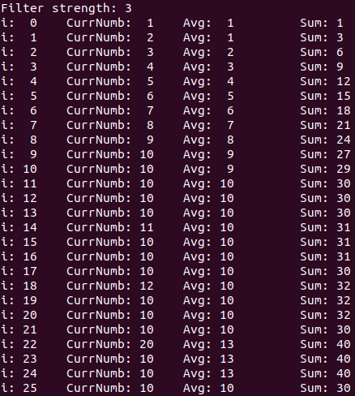

# Moving average library
Check `example.c` to see how this library should be used.  
To run this example (on Linux) type: `bash run.sh` in root folder of this project.  
Change `MOVING_AVERAGE_FILTER_STRENGTH_x` to suit your needs.  Just note that it should be between 2 and 255.  
 

# Thanks
Thanks to ' bmccormack' which inspired this project. Here is [LINK](https://gist.github.com/bmccormack/d12f4bf0c96423d03f82) to his code.

# Suggestions
If you have any suggestions please let me know.

# License
Licensed under the GPLV3 License